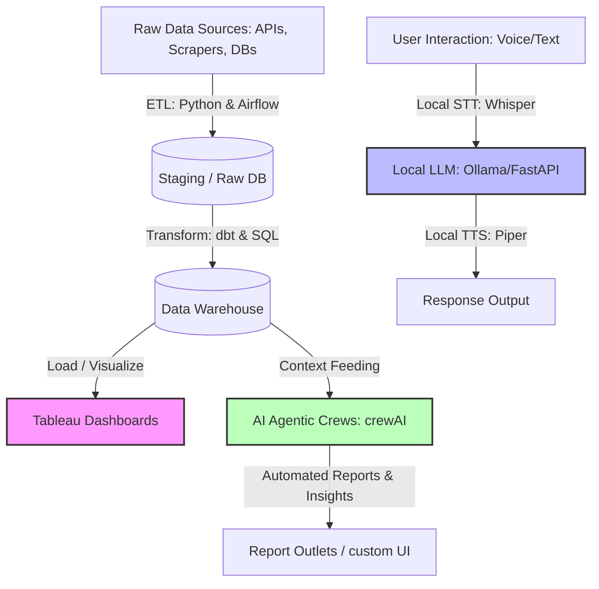

# Hi there, I'm Pranit Patil! 👋

## Tableau Developer | Data Analyst | ETL Pipeline Automation & AI Engineer

I specialize in building end-to-end data solutions and intelligent agentic systems. I bridge the gap between raw data, advanced AI reasoning, and strategic business decisions by designing automated ETL/ELT pipelines, deploying local AI applications, and building interactive Tableau dashboards.

---

### 🚀 What I Do:
* **Tableau Dashboards & Data Analytics**: Crafting high-performance, interactive, and visually stunning dashboards that tell clear stories and drive business actions.
* **ETL & Data Pipelines**: Orchestrating robust workflows (Extract, Transform, Load) to aggregate and clean data using Python, SQL, dbt, and Apache Airflow.
* **AI & Agentic Workflows**: Designing multi-agent AI systems (crewAI) and local AI applications (Voice Assistants, STT/TTS models) that run completely offline.

---

### 🛠️ My Tech Stack & Toolkit

| Category | Technologies & Tools |
| :--- | :--- |
| **Data Visualization** | `Tableau` `Power BI` `Next.js (Custom Portfolios)` `HTML/CSS/JS` |
| **ETL & Orchestration** | `Apache Airflow` `dbt` `Alteryx` `Cron Jobs` |
| **AI & Agentic Systems** | `crewAI` `Ollama` `faster-whisper (STT)` `Piper (TTS)` `Silero VAD` |
| **Programming Languages** | `Python (Pandas, BeautifulSoup, NumPy)` `SQL (PostgreSQL, BigQuery, Snowflake)` `Bash` |
| **Databases & Version Control** | `PostgreSQL` `MySQL` `Google BigQuery` `Git / GitHub` `Docker` `GitHub Actions` |

---

### 📊 Modern Data Stack & Agentic Integration Architecture

---

### 📂 Consolidated Portfolio Projects

All of my core portfolio projects are organized and maintained in my main **[Data & AI Portfolio Repository](https://github.com/Code-Falcon001/Data-and-AI-Portfolio)**:

#### 🤖 AI & Agentic Workflows

##### 🎙️ [ARIA - Fully Local AI Voice Assistant](https://github.com/Code-Falcon001/Data-and-AI-Portfolio/tree/main/AI-Projects/LocalVoiceAssistant)
* A completely offline, real-time voice assistant built with Python, FastAPI, and Electron.
* **Core Stack**: FastAPI, Electron, `faster-whisper` (STT), Piper TTS, Silero VAD, and Ollama.
* **Features**: Live glassmorphism UI, barge-in voice interruption, and complete data privacy.

##### 🤖 [CrewAI Multi-Agent Research System](https://github.com/Code-Falcon001/Data-and-AI-Portfolio/tree/main/AI-Projects/latest-ai-development)
* A collaborative multi-agent AI system designed to perform automated research and generate structured markdown reports.
* **Core Stack**: Python, crewAI framework, local/remote LLM integrations.

---

#### ⚙️ Data Engineering & ETL

##### 🕷️ [ETL Scraping & Matcher Pipeline](https://github.com/Code-Falcon001/Data-and-AI-Portfolio/tree/main/Data-Automation/Web-Scraping)
* An automated web scraping pipeline that extracts web data, parses structures, runs skill matching, and outputs cleaned Excel data feeds.
* **Core Stack**: Python, BeautifulSoup, Pandas.

---

#### 📈 Business Intelligence & Web Portfolios

##### 📊 [Tableau Portfolio App](https://github.com/Code-Falcon001/Data-and-AI-Portfolio/tree/main/Dashboards/Tableau-Portfolio)
* A web-based Next.js portfolio showcasing dashboard wireframes, design mockups, and embedded Tableau Public visualization links.
* **Core Stack**: Next.js, React, CSS, Vercel.

##### 🌐 [Vanilla HTML/JS Portfolio Website](https://github.com/Code-Falcon001/Data-and-AI-Portfolio/tree/main/Websites/portfolio)
* A clean, sleek custom web portfolio built with Vanilla HTML/CSS/JavaScript.

---

### 📈 GitHub Stats

| Stats | Languages |
| :---: | :---: |
|  |  |

---

### 📬 Connect with Me

* 💼 **LinkedIn**: [linkedin.com/in/your-profile](https://linkedin.com/in/your-profile)
* 📊 **Tableau Public**: [public.tableau.com/app/profile/your-profile](https://public.tableau.com/app/profile/your-profile)
* ✉️ **Email**: [your.email@example.com](mailto:your.email@example.com)
