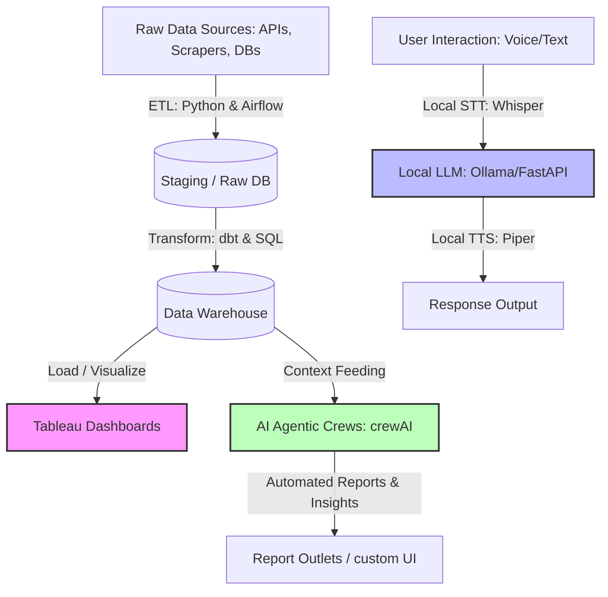

# Hi there, I'm Pranit Patil! 👋

## Tableau Developer | Data Analyst | ETL Pipeline Automation & AI Engineer

I specialize in building end-to-end data solutions and intelligent agentic systems. I bridge the gap between raw data, advanced AI reasoning, and strategic business decisions by designing automated ETL/ELT pipelines, deploying local AI applications, and building interactive Tableau dashboards.

---

### 🚀 What I Do:
* **Tableau Dashboards & Data Analytics**: Crafting high-performance, interactive, and visually stunning dashboards that tell clear stories and drive business actions.
* **ETL & Data Pipelines**: Orchestrating robust workflows (Extract, Transform, Load) to aggregate and clean data using Python, SQL, dbt, and Apache Airflow.
* **AI & Agentic Workflows**: Designing multi-agent AI systems (crewAI) and local AI applications (Voice Assistants, STT/TTS models) that run completely offline.

---

### 🛠️ My Tech Stack & Toolkit

| Category | Technologies & Tools |
| :--- | :--- |
| **Data Visualization** | `Tableau` `Power BI` `Next.js (Custom Portfolios)` `HTML/CSS/JS` |
| **ETL & Orchestration** | `Apache Airflow` `dbt` `Alteryx` `Cron Jobs` |
| **AI & Agentic Systems** | `crewAI` `Ollama` `faster-whisper (STT)` `Piper (TTS)` `Silero VAD` |
| **Programming Languages** | `Python (Pandas, BeautifulSoup, NumPy)` `SQL (PostgreSQL, BigQuery, Snowflake)` `Bash` |
| **Databases & Version Control** | `PostgreSQL` `MySQL` `Google BigQuery` `Git / GitHub` `Docker` `GitHub Actions` |

---

### 📊 Modern Data Stack & Agentic Integration Architecture

---

### 📂 Category Portfolio Repositories

My core portfolio projects are grouped into 4 specialized repositories on my account:

#### 🤖 [AI & Agentic Projects](https://github.com/Code-Falcon001/AI-Projects)
* 🎙️ **[ARIA - Fully Local AI Voice Assistant](https://github.com/Code-Falcon001/AI-Projects/tree/main/LocalVoiceAssistant)**: A completely offline, real-time voice assistant built with Python, FastAPI, and Electron.
* 🤖 **[CrewAI Multi-Agent Research System](https://github.com/Code-Falcon001/AI-Projects/tree/main/latest-ai-development)**: A collaborative multi-agent AI system designed to perform automated research and generate structured markdown reports.

#### ⚙️ [Data Automation & ETL](https://github.com/Code-Falcon001/Data-Automation)
* 🕷️ **[ETL Scraping & Matcher Pipeline](https://github.com/Code-Falcon001/Data-Automation/tree/main/Web-Scraping)**: An automated web scraping pipeline that extracts web data, parses structures, runs skill matching, and outputs cleaned Excel data feeds.
* 📊 **[Excel Consolidation Engine](https://github.com/Code-Falcon001/Data-Automation/tree/main/excel-consolidation-engine)**: A config-driven Excel VBA consolidation engine designed to merge multiple sheets automatically.
* 🕵️‍♂️ **[Excel Change Tracker (v1 & v2)](https://github.com/Code-Falcon001/Data-Automation/tree/main/excel-change-tracker-v2)**: HTML/VBA utility engines designed to track modifications in Excel workbooks.

#### 📊 [BI Dashboards & Visualizations](https://github.com/Code-Falcon001/Dashboards)
* 📈 **[Tableau Portfolio App](https://github.com/Code-Falcon001/Dashboards/tree/main/Tableau-Portfolio)**: A web-based Next.js portfolio showcasing dashboard wireframes, design mockups, and embedded Tableau Public visualization links.
* 📊 **[Buyer PO Dashboard (Power BI)](https://github.com/Code-Falcon001/Dashboards/tree/main/Power-BI-Projects/Buyer%20PO%20Dashboards)**: A Power BI dashboard tracking purchase orders, buyer activity, and supplier timelines.
* 📊 **[Sales Dashboard (Power BI)](https://github.com/Code-Falcon001/Dashboards/tree/main/Sales-Dashboard-Power-BI)**: A multi-year sales performance and delivery timing dashboard built with Power BI.

#### 🌐 [Websites & Frontend](https://github.com/Code-Falcon001/Websites)
* 💻 **[Vanilla HTML/JS Portfolio Website](https://github.com/Code-Falcon001/Websites/tree/main/portfolio)**: A clean, sleek custom web portfolio built with Vanilla HTML/CSS/JavaScript.

---

### 📈 GitHub Stats

| Stats | Languages |
| :---: | :---: |
|  |  |

---

### 📬 Connect with Me

* 💼 **LinkedIn**: [linkedin.com/in/your-profile](https://linkedin.com/in/your-profile)
* 📊 **Tableau Public**: [public.tableau.com/app/profile/your-profile](https://public.tableau.com/app/profile/your-profile)
* ✉️ **Email**: [your.email@example.com](mailto:your.email@example.com)
